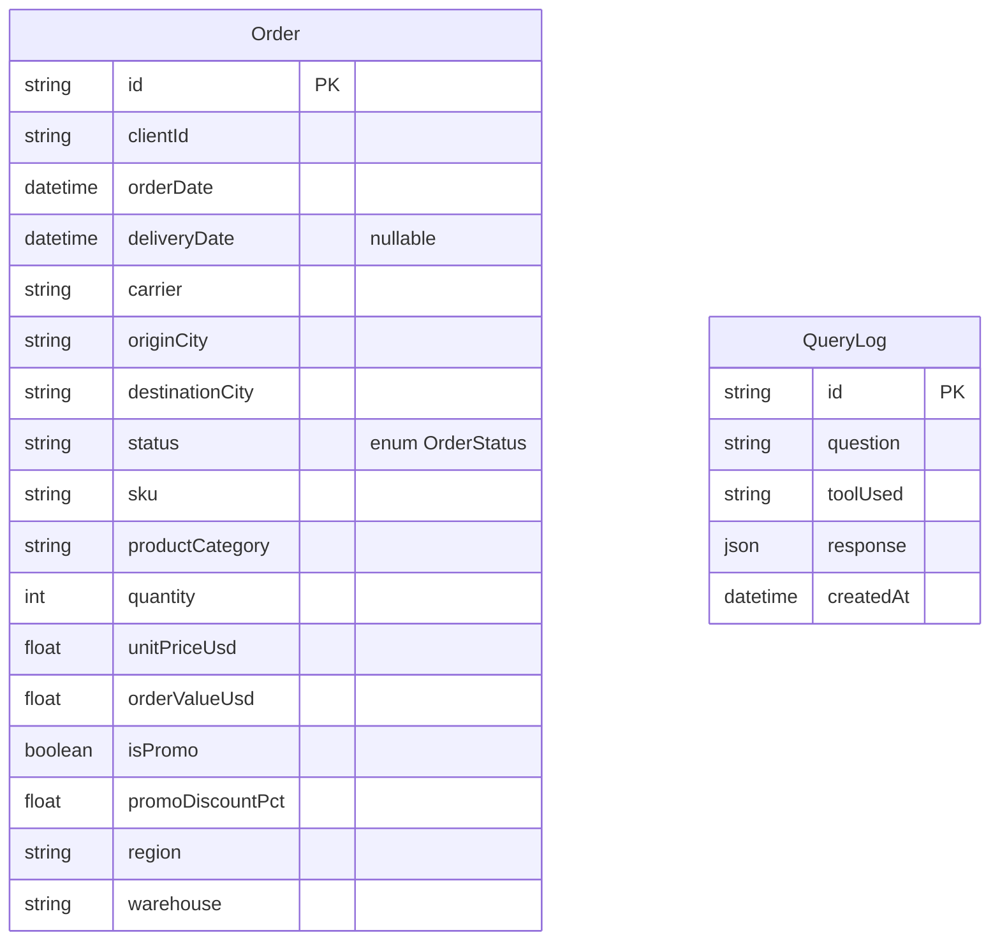

# Functional Specification Document — Logistics AI Dashboard

Source requirements: [`REQUIREMENTS.md`](./REQUIREMENTS.md)
Source dataset: [`data/mock_logistics_data.csv`](./data/mock_logistics_data.csv)

## 1. Overview

An AI-powered analytics dashboard for a logistics client, covering three levels of intelligence over **one unified dataset** (the 400-row order CSV):

- **Descriptive** — KPI cards + charts on the dashboard home page.
- **Diagnostic** — a natural-language "Ask AI" interface that answers questions by computing over the same data, never by guessing.
- **Predictive / prescriptive** — a demand forecasting tool with an inventory recommendation.

The AI layer is a **router**, not a source of truth: it interprets the question, emits a structured, schema-validated call to one of two deterministic tools, and the tool — plain TypeScript + Prisma — does the actual computation. The model only sees computed numbers when phrasing its final answer.

## 2. Goals / Non-Goals

**Goals**
- Correct, explainable analytics over the provided dataset.
- NL query → structured tool call → deterministic computation → grounded answer + chart.
- Basic, honest forecasting (linear trend) with a stated methodology.
- Deployable as-is to the already-provisioned Prisma Compute + Prisma Postgres project.

**Non-goals (explicitly out of scope, per "do not over-engineer")**
- Auth / multi-tenant access control (single shared read-only dataset, no login).
- Free-form AI-generated SQL.
- Real-time ingestion, write paths, or editing orders (data is read-only).
- Arbitrary open-ended chart types beyond bar/line/table — chosen by a deterministic rule, not the model.

## 3. Dataset & Data Model

### 3.1 Source shape

`docs/data/mock_logistics_data.csv`, 400 rows, one row per order:

| Column | Notes |
|---|---|
| `client_id` | 30 distinct clients |
| `order_id` | unique, e.g. `ORD-2026-267300-0001` |
| `order_date` | 2025-01-01 → 2025-12-30 |
| `delivery_date` | present for `delivered`/`delayed`/`exception` (370 rows); empty otherwise |
| `carrier` | 9 values (DHL, FedEx, UPS, USPS, LaserShip, OnTrac, GLS, DPD, Royal Mail) |
| `origin_city`, `destination_city` | free text, "City, Region" |
| `status` | `delivered` (304) · `delayed` (55) · `exception` (11) · `in_transit` (27) · `canceled` (3) |
| `sku` | 355 distinct values — mostly one order per SKU (see 3.3) |
| `product_category` | 8 values (PAPER, CRAYON, BOOK, PENCIL, STICKER, MARKER, BRUSH, PAINT) |
| `quantity`, `unit_price_usd`, `order_value_usd` | numeric |
| `is_promo`, `promo_discount_pct` | promo flag/discount |
| `region` | UK, EU, US-C, US-E, US-W |
| `warehouse` | 9 fulfillment centers |

### 3.2 Prisma schema

One denormalized `Order` table mirroring the CSV 1:1 — the "unified dataset," no lookup tables, simplicity over normalization for a 400-row / 6–10 hour time-box. A second table, `QueryLog`, persists each Ask AI question/answer for the recent-questions feature (§5.2) — no foreign key to `Order`, and the only table the app writes to.

> **Prisma 7:** this project pins `prisma@7`, which dropped the bundled query engine binary in favor of a driver adapter or Prisma Accelerate. The client connects via `accelerateUrl` (`@prisma/extension-accelerate`, `lib/prisma.ts`), since the database is Prisma Postgres. Connection URL/migrations config lives in `prisma.config.ts`, not the schema's `datasource` block.

#### ERD



No relation between the two tables — `QueryLog.response` stores the AI's full structured response, not a reference back to `Order` rows.

```prisma
enum OrderStatus {
  DELIVERED
  DELAYED
  EXCEPTION
  IN_TRANSIT
  CANCELED
}

model Order {
  id               String      @id            // = source order_id
  clientId         String
  orderDate        DateTime
  deliveryDate     DateTime?
  carrier          String
  originCity       String
  destinationCity  String
  status           OrderStatus
  sku              String
  productCategory  String
  quantity         Int
  unitPriceUsd     Float
  orderValueUsd    Float
  isPromo          Boolean
  promoDiscountPct Float
  region           String
  warehouse        String

  @@index([orderDate])
  @@index([status])
  @@index([carrier])
  @@index([productCategory])
  @@index([region])
}

model QueryLog {
  id        String   @id @default(cuid())
  question  String
  toolUsed  String
  response  Json
  createdAt DateTime @default(now())

  @@index([createdAt])
}
```

`prisma/seed.ts` parses the CSV and upserts all 400 `Order` rows. `Order` is read-only — no route ever writes to it. `QueryLog` is the one exception: `POST /api/query` writes one row per question.

### 3.3 Data-driven assumptions

Forced by what's actually in the CSV, not arbitrary choices:

1. **No SLA / expected-delivery-date column exists.** `status` is the delay signal: on-time = `DELIVERED`, late = `DELAYED`/`EXCEPTION`; `IN_TRANSIT`/`CANCELED` excluded from on-time-rate and avg-delivery-time (no completed outcome yet).
2. **Forecasting granularity is `productCategory`, not raw `sku`.** 355 SKUs appear in only 1–3 orders across the year — not enough history to fit a trend. The 8 categories have ~10–12 months of data each. The Forecast Tool accepts a category (required) and optional SKU (informational); a SKU-level request is substituted to category level and the response says so.
3. **Relative date phrases ("last month") resolve against `MAX(orderDate)`**, not wall-clock time — the dataset is a static 2025 snapshot. `datasetAnchorDate()` (`lib/date-anchor.ts`) is used only by the Query Tool; the Forecast Tool has no date filters and uses `datasetRange()` (`lib/dashboard.ts`) instead, to bound its historical month series.

## 4. System Architecture

```
Browser
  ├─ / (Dashboard)     React Query → GET /api/dashboard/summary
  ├─ /ask (Ask AI)     React Query → POST /api/query, GET /api/query/history
  ▼
Next.js Route Handlers
  ├─ /api/dashboard/summary  ── deterministic Prisma aggregation (no AI)
  ├─ /api/query/history      ── reads recent QueryLog rows (no AI)
  └─ /api/query
        ▼
     AI Orchestrator (Vercel AI SDK + OpenAI, tool-calling)
        interprets NL question → picks ONE tool → emits zod-validated args
        ├─ queryAnalyticsTool  → Query DSL → filter/group over in-memory orders
        └─ forecastDemandTool  → historical monthly series → OLS regression
        ▼
     grounded answer generation (restates computed numbers; never invents figures)
        ▼
     { answer, explanation, chartSpec, data } → persisted to QueryLog → UI
                ▼
     Prisma Postgres: Order (read-only, Accelerate-cached) · QueryLog (write-once)
```

**Why this shape satisfies REQUIREMENTS §5/§9:** the AI never touches the database or emits SQL — it emits a small, typed argument object; an ordinary TypeScript function executes it. Chart type is a pure function of the query shape, not the model's choice. "AI interpretation," "computation," and "business logic" stay three separate, independently testable layers. `QueryLog` persistence happens in the route handler after the orchestrator returns, not inside it — same separation applied to the logging side effect.

**Client-side caching:** both pages use React Query (`["dashboard-summary", from, to]`, `["query-history"]`) as a session-local complement to the server-side Accelerate cache — different tabs/users still share the Accelerate cache; React Query only dedupes within one browser session.

## 5. Feature Specs

### 5.1 Dashboard (`/`)

**KPIs** (`GET /api/dashboard/summary`, optional `?from=&to=`, defaults to full range): total orders, delivered, delayed (`DELAYED`+`EXCEPTION`), on-time rate, avg delivery time.

**Charts:** order volume over time (line), delivery performance on-time vs. delayed (bar/donut), carrier delay-rate breakdown (horizontal bar).

A date-range control re-fetches with new bounds; React Query makes a previously-seen range in the same session a cache hit.

### 5.2 Ask AI (`/ask`)

Single-turn form (no multi-turn memory — each question is independent). On submit:

1. `POST /api/query { question }`.
2. Orchestrator selects `queryAnalyticsTool` or `forecastDemandTool`, executes it.
3. The route persists `{ question, toolUsed, response }` to `QueryLog` — awaited, but a write failure never fails the user-facing response.
4. Renders answer, auto-selected chart, and an always-visible explainability panel (filters, metric/dimension, resolved date range, raw query plan, underlying-rows table).

**Recent questions:** a collapsed-by-default `<details>` below the response (not between the input and the answer). Nothing is fetched until opened (`useInfiniteQuery`'s `enabled: isOpen`) — visiting `/ask` never pays for a history fetch unless the user asks for it. Once open, `GET /api/query/history` is paginated by cursor (`?cursor=&limit=`, 5 per page, newest first); scrolling the list's own `max-h-56 overflow-y-auto` region to its end (an `IntersectionObserver` on a sentinel row, scoped to that scroll container, not the window) loads the next page — the box's height never grows regardless of how much history exists. Clicking an entry re-submits it through the same mutation used for typing — a real "ask again," not a replay of the stored answer. A successful `POST /api/query` invalidates `["query-history"]`, resetting back to the first page with the new question included.

Covers the three REQUIREMENTS §4.2 example questions directly:
- "Show delayed orders by week for the last 3 months" → `metric: count`, `filter: status in [DELAYED, EXCEPTION]`, `groupBy: week`, `relativeDateRange: last_3_months`.
- "Which carrier has the highest delay rate?" → `metric: delayRate`, `groupBy: carrier`, sorted desc.
- "How many orders were delivered late last month?" → `metric: count`, `filter: status=DELAYED, relativeDateRange: last_month`.
- "Predict demand for CRAYON for the next 4 months" → `forecastDemandTool`, `category: CRAYON`, `horizonMonths: 4`.

### 5.3 Dynamic Chart Generation

Deterministic mapping (pure function, unit-tested), not model-guessed:

| DSL shape | Chart |
|---|---|
| `groupBy: day\|week\|month` | line chart |
| `groupBy: carrier\|region\|category\|status` | horizontal bar chart |
| no `groupBy` | stat card, no chart |
| forecast result | line chart, historical + forecast segments styled distinctly |

### 5.4 Explainability

Every `/api/query` response includes, unconditionally:
```ts
{
  answer: string
  toolUsed: "queryAnalytics" | "forecastDemand"
  queryPlan: {...validated tool args...}
  filtersApplied: { dateRange, status?, carrier?, region?, category? }
  metric: string
  dimension?: string
  data: Row[]
  methodology?: string  // forecast tool only
}
```
Shown as a panel next to the answer, not a debug drawer.

### 5.5 Forecasting Tool

Input: `{ category, horizonMonths: 1-6 (default 4), sku? }`.

1. Aggregate historical monthly `sum(quantity)` for the category, over `datasetRange()`.
2. Fit OLS linear regression (month index → quantity).
3. Project `horizonMonths` forward; floor at 0.
4. Inventory recommendation = `forecast + 1.5 × stddev(residuals)` — a stated formula, not AI-invented.

Output: historical + forecast series, per-month recommendation, and a plain-English methodology string.

## 6. AI Orchestration Design

- **Provider:** OpenAI via Vercel AI SDK, model configurable via `OPENAI_MODEL` (default `gpt-4o-mini`).
- **Tools:** `queryAnalytics(metric, dimension?, groupBy?, filters?)`, `forecastDemand(category, horizonMonths?, sku?)`.
- **Flow:** one `generateText` call with `tools` + `toolChoice: "required"` — the model must pick exactly one tool, never a freeform answer. A second, short generation turns the tool's result into the `answer` sentence, instructed to restate only numbers present in it.
- **Ambiguity:** an unmappable question returns a `clarify` response (no chart) instead of guessing.
- **Safety:** no AI-authored SQL or Prisma raw queries; the DSL is a closed, enum-validated shape.

## 7. API Contracts

### `GET /api/dashboard/summary?from=YYYY-MM-DD&to=YYYY-MM-DD`
```ts
{
  range: { from: string; to: string }
  kpis: { totalOrders, delivered, delayed, onTimeRate, avgDeliveryDays }
  orderVolumeByMonth: { month: string; count: number }[]
  deliveryPerformance: { onTime: number; late: number }
  carrierBreakdown: { carrier: string; total: number; delayRate: number }[]
}
```

### `POST /api/query { question: string }`
See §5.4. `400` on empty question; `200` with a `clarify` status when the model can't resolve a tool; `502` on upstream AI failure (the dashboard never depends on this route). Persists a `QueryLog` row as a side effect.

### `GET /api/query/history?cursor=&limit=`
```ts
{
  history: { id: string; question: string; toolUsed: string; response: OrchestratorResponse; createdAt: string }[]
  nextCursor: string | null   // a QueryLog id; null when there's no next page
}
```
Newest first, cursor-paginated (default `limit`: 5, max: 20). `cursor` is the `id` of the last item from the previous page.

## 8. Non-Functional Requirements

- **Performance:** single indexed Prisma queries — sub-second on 400 rows.
- **Caching:** `getAllOrders()` uses Accelerate's edge cache (`ttl: 300, swr: 600`) since `Order` only changes via manual reseed. `QueryLog` reads are deliberately uncached — that table changes on every question. React Query adds a session-local client cache on top.
- **Read-only analytical data:** enforced structurally for `Order` (no mutation route exists). `QueryLog` is the one table the app writes to, only via `POST /api/query`.
- **Deployment:** GitHub → Prisma Compute, `output: "standalone"`. `postinstall` runs `prisma generate`; migrations applied via `prisma migrate deploy` as a manual step, not on every build.
- **Secrets:** `DATABASE_URL`, `OPENAI_API_KEY` — never committed; `.env.example` documents both.

## 9. Limitations

- Forecasting is category-level only, per 3.3(2).
- No multi-turn conversation memory in Ask AI.
- Chart types limited to line/bar/stat by design.
- No auth — acceptable for a read-only demo dataset.

## 10. Future Improvements

- Exponential smoothing as a second forecast method.
- Multi-turn chat context for follow-up questions.
- Cache-tag-based invalidation wired into `db:seed`, instead of relying on `ttl` expiry.
- A dedicated test database for integration tests.
- CI (GitHub Actions) to run all three test layers on push/PR.

## 11. Testing Strategy

A pyramid: most coverage at the bottom (fast, free, deterministic), less at the top (slower, more infrastructure).

| Layer | Tool | Location | Count | What it verifies |
|---|---|---|---|---|
| Unit | Vitest | `lib/*.test.ts` | 48 tests, 5 files | Pure functions against the real seed CSV as fixture data: aggregation, query DSL, date-anchor, forecasting, chart selection. No DB, no network. 100% statement/branch/function/line coverage. |
| Integration | Vitest | `tests/integration/*.test.ts` | 9 tests, 3 files | Route handlers invoked directly (real `Request`/`NextRequest`, no HTTP server) against the real database. Verifies Prisma queries, Accelerate `cacheStrategy`, cursor pagination boundaries, and that a mocked tool-call still flows through the real `executeQueryAnalytics`/`forecastCategory` into a real `QueryLog` row. Files run sequentially (`fileParallelism: false`) — a shared real database has no built-in test isolation, and a tight pagination-boundary assertion would flake if another file's rows landed in between otherwise. |
| E2E | Playwright | `tests/e2e/*.test.ts` | 10 tests, 3 files | Real browser against a real server (port 3100). Dashboard specs read the real seeded DB (no AI dependency, nothing mocked). Ask AI specs mock `/api/query`/`/api/query/history` at the network layer and verify rendering — answer, chart, explainability, clarify state, history "ask again," the bounded-scroll layout, that history stays collapsed/unfetched until opened, and infinite-scroll pagination via a real scroll gesture. |

**AI is mocked at every automated layer, never called for real** — a live call is slow, costs money, and is non-deterministic. Integration mocks only `generateText` from the `ai` SDK, feeding a fixed tool-call shape and asserting the real computation downstream — the boundary REQUIREMENTS §9 draws ("AI must NOT generate answers without computation"). E2E mocks the whole `/api/query` call, since by then the goal is "does the browser render this correctly," not tool selection. Whether the model *itself* picks the right tool was verified manually during development, not by CI.

`KpiCard` and `QueryHistoryList` gained `data-testid` attributes purely for stable Playwright selectors (number-only KPI values and duplicate question text aren't reliably selectable by text/role alone) — inert, no runtime behavior.

**⚠️ Integration tests write to whatever `DATABASE_URL` points at** (`QueryLog` rows, deleted in `afterEach`). Use a local/dev database, never production.

**Coverage** (`npm run test:coverage`, `@vitest/coverage-v8`) is scoped to `lib/` minus DB/AI-touching files (`lib/ai/**`, `lib/prisma.ts`, `lib/orders.ts`, `lib/query-log.ts`), which the integration layer covers instead. Currently 100%. Closing the last gaps found two structurally-dead branches (`dashboard.ts`'s and `forecast.ts`'s zero-division guards, unreachable given their callers' invariants) — removed rather than tested around, since a contrived test for unreachable code proves nothing.

```bash
npm test                    # unit only — fast, no DB required
npm run test:coverage       # unit tests + coverage report
npm run test:integration    # real DB required
npm run test:e2e            # Playwright — `npx playwright install chromium` once first
```
