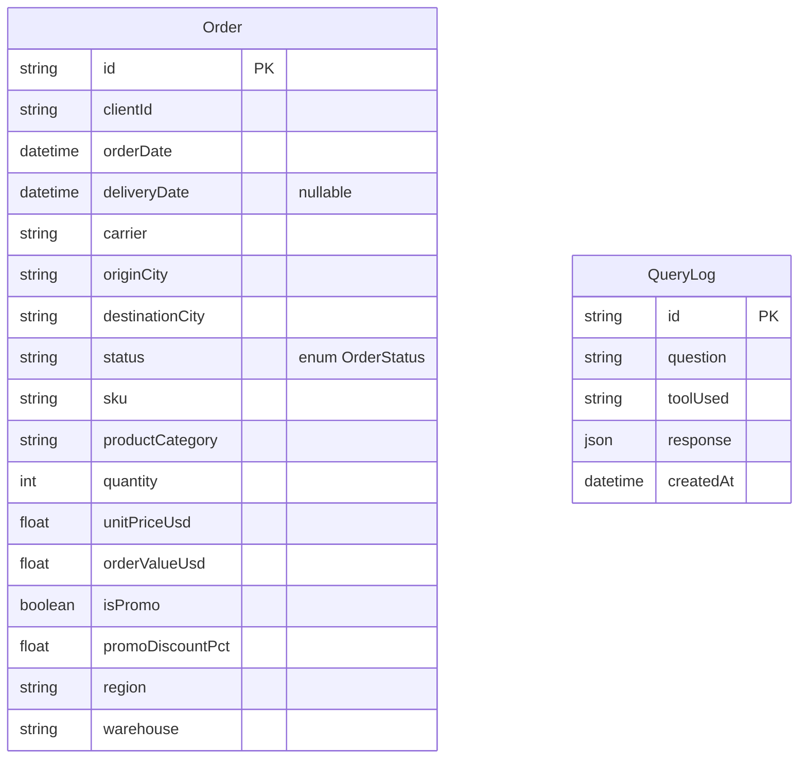

# Functional Specification Document — Logistics AI Dashboard

Source requirements: [`REQUIREMENTS.md`](./REQUIREMENTS.md)
Source dataset: [`data/mock_logistics_data.csv`](./data/mock_logistics_data.csv)

## 1. Overview

An AI-powered analytics dashboard for a logistics client, covering three levels of intelligence over **one unified dataset** (the 400-row order CSV):

- **Descriptive** — KPI cards + charts on the dashboard home page.
- **Diagnostic** — a natural-language "Ask AI" interface that answers questions by computing over the same data, never by guessing.
- **Predictive / prescriptive** — a demand forecasting tool with an inventory recommendation.

The AI layer is a **router**, not a source of truth: it interprets the question, emits a structured, schema-validated call to one of two deterministic tools, and the tool — plain TypeScript + Prisma — does the actual computation. The model only sees computed numbers when phrasing its final answer.

## 2. Goals / Non-Goals

**Goals**
- Correct, explainable analytics over the provided dataset.
- NL query → structured tool call → deterministic computation → grounded answer + chart.
- Basic, honest forecasting (linear trend) with a stated methodology.
- Deployable as-is to the already-provisioned Prisma Compute + Prisma Postgres project.

**Non-goals (explicitly out of scope, per "do not over-engineer")**
- Auth / multi-tenant access control (single shared read-only dataset, no login).
- Free-form AI-generated SQL.
- Real-time ingestion, write paths, or editing orders (data is read-only).
- Arbitrary open-ended chart types beyond bar/line/table — chart type is chosen by a deterministic rule, not by the model.

## 3. Dataset & Data Model

### 3.1 Source shape

`docs/data/mock_logistics_data.csv`, 400 rows, one row per order:

| Column | Notes |
|---|---|
| `client_id` | 30 distinct clients |
| `order_id` | unique, e.g. `ORD-2026-267300-0001` |
| `order_date` | 2025-01-01 → 2025-12-30 |
| `delivery_date` | present for `delivered`/`delayed`/`exception` (370 rows); empty for `in_transit`/`canceled` (30 rows) |
| `carrier` | 9 values (DHL, FedEx, UPS, USPS, LaserShip, OnTrac, GLS, DPD, Royal Mail) |
| `origin_city`, `destination_city` | free text, "City, Region" |
| `status` | `delivered` (304) · `delayed` (55) · `exception` (11) · `in_transit` (27) · `canceled` (3) |
| `sku` | 355 distinct values — **mostly one order per SKU** (see 3.3) |
| `product_category` | 8 values (PAPER, CRAYON, BOOK, PENCIL, STICKER, MARKER, BRUSH, PAINT), 42–69 rows each |
| `quantity`, `unit_price_usd`, `order_value_usd` | numeric |
| `is_promo`, `promo_discount_pct` | promo flag/discount |
| `region` | UK, EU, US-C, US-E, US-W |
| `warehouse` | 9 fulfillment centers |

### 3.2 Prisma schema

One denormalized `Order` table mirroring the CSV 1:1 (this **is** the "unified dataset" — no separate lookup tables; simplicity over normalization, matching the assignment's time-box). Indexed on the columns every KPI/tool filters or groups by.

A second table, `QueryLog`, persists each "Ask AI" question/answer pair for the recent-questions feature (§5.2). It has no foreign key to `Order` — it's an application-level log, not part of the analytical dataset, and is the only table the app ever writes to.

> **Prisma 7 note:** this project pins `prisma@7`, which removed the bundled query engine binary in favor of either a driver adapter or Prisma Accelerate. The schema's `generator` block uses `provider = "prisma-client"` with an explicit `output` path (client generates to `generated/prisma`, gitignored, regenerated via `postinstall`), and the app connects through Prisma Accelerate — `new PrismaClient({ accelerateUrl })` via `@prisma/extension-accelerate` (`lib/prisma.ts`) — since the database is Prisma Postgres, not a bare `new PrismaClient()`. Connection URL/migrations config lives in `prisma.config.ts`, not in the `datasource` block (v7 deprecated `url`/`directUrl` there).

#### ERD



`Order` is read-only (seeded once from the CSV, never mutated by a route). `QueryLog` is written once per `/api/query` call and read by `/api/query/history` — no relation between the two tables; the log stores the AI's full structured response, not a reference back to specific `Order` rows.

```prisma
enum OrderStatus {
  DELIVERED
  DELAYED
  EXCEPTION
  IN_TRANSIT
  CANCELED
}

model Order {
  id               String      @id            // = source order_id
  clientId         String
  orderDate        DateTime
  deliveryDate     DateTime?
  carrier          String
  originCity       String
  destinationCity  String
  status           OrderStatus
  sku              String
  productCategory  String
  quantity         Int
  unitPriceUsd     Float
  orderValueUsd    Float
  isPromo          Boolean
  promoDiscountPct Float
  region           String
  warehouse        String

  @@index([orderDate])
  @@index([status])
  @@index([carrier])
  @@index([productCategory])
  @@index([region])
}

/// Persisted "Ask AI" question/answer pairs for the recent-questions list
/// and for audit/debugging. `response` is not replayed to the UI — clicking
/// a history entry re-submits the question through POST /api/query for a
/// fresh, real answer (see §5.2).
model QueryLog {
  id        String   @id @default(cuid())
  question  String
  toolUsed  String
  response  Json
  createdAt DateTime @default(now())

  @@index([createdAt])
}
```

Seed script (`prisma/seed.ts`) parses the CSV and upserts all 400 `Order` rows. `Order` is treated as **read-only** by the application — no route ever writes to it. `QueryLog` is the one exception to "read-only": `POST /api/query` writes one row per question (see §5.2, §6).

### 3.3 Data-driven assumptions (record in README too)

These are forced by what's actually in the CSV, not arbitrary choices:

1. **No SLA / expected-delivery-date column exists.** `status` is treated as the authoritative delay signal:
   - On-time = `DELIVERED`
   - Late = `DELAYED` or `EXCEPTION`
   - `IN_TRANSIT` / `CANCELED` are excluded from on-time-rate and avg-delivery-time denominators (no completed outcome yet).
2. **Forecasting granularity is `productCategory`, not raw `sku`.** 355 of the CSV's SKUs appear in only 1–3 orders across the whole year — not enough history to fit a trend. The 8 `productCategory` values have ~10–12 months of data points each, which is forecastable. The Forecast Tool accepts a category (required) and an optional SKU (informational only); if a user asks to forecast a specific SKU, the tool explains the substitution to category-level in its response rather than silently forecasting from 1–2 points.
3. **Relative date phrases ("last month", "last 3 months") resolve against `MAX(orderDate)` in the dataset, not the server's wall-clock date.** The dataset is a static 2025 snapshot; anchoring to real "today" would silently return empty results. `datasetAnchorDate()` (`lib/date-anchor.ts`) recomputes this from the in-memory order array on each call — cheap at 400 rows, so no memoization — and is used only by the Query Tool (`lib/query-dsl.ts`); the Forecast Tool has no date filters and instead uses `datasetRange()` (`lib/dashboard.ts`) to bound its historical month series.

## 4. System Architecture

```
Browser
  │
  ├─ / (Dashboard)              Client Component → React Query → GET /api/dashboard/summary
  ├─ /ask (Ask AI)              Client Component → React Query → POST /api/query, GET /api/query/history
  │
  ▼
Next.js App Router (Route Handlers)
  │
  ├─ /api/dashboard/summary  ── deterministic Prisma aggregation (no AI)
  │
  ├─ /api/query/history      ── reads recent QueryLog rows (no AI)
  │
  └─ /api/query
        │
        ▼
     AI Orchestrator (Vercel AI SDK + OpenAI, tool-calling)
        │  interprets NL question → picks ONE tool → emits zod-validated args
        │
        ├─ queryAnalyticsTool  → Structured Query DSL → Prisma groupBy/aggregate → rows + chartSpec
        └─ forecastDemandTool  → historical monthly series → linear regression → forecast + recommendation
        │
        ▼
     grounded answer generation (model restates the computed numbers; never invents figures)
        │
        ▼
     { answer, explanation, chartSpec, data } → persisted to QueryLog → UI
                                                      ▼
                                            Prisma Postgres
                                              ├─ Order (read-only, Accelerate-cached reads)
                                              └─ QueryLog (write-once per question, read by history)
```

**Why this shape satisfies §5/§9 of the requirements:** the AI never touches the database or emits SQL. It emits a small, typed argument object (zod-validated); an ordinary TypeScript function executes it via Prisma's query builder (`groupBy`/`aggregate`/`count`), never raw/interpolated SQL. The chart type is chosen by a pure function of the DSL shape, not by the model. This keeps "AI interpretation," "data computation," and "business logic" in three separate, independently testable layers per §9. Persisting to `QueryLog` happens in the route handler after the orchestrator returns, not inside the orchestrator itself — same separation principle applied to the "log the request" side effect.

**Client-side caching (React Query):** both pages use `@tanstack/react-query` instead of manual `useEffect`/`useState` fetch plumbing. The dashboard's `useQuery` key is `["dashboard-summary", from, to]`, so switching date ranges and back doesn't re-fetch already-seen ranges within the session. Ask AI's history list (`["query-history"]`) is invalidated after every successful `/api/query` mutation, so a newly-asked question appears immediately. This is a session-local complement to the server-side Accelerate cache (§8), not a replacement for it — different tabs/users still share the Accelerate cache; React Query only dedupes within one browser session.

## 5. Feature Specs

### 5.1 Dashboard (`/`)

**KPIs** (server-computed, `GET /api/dashboard/summary`, optional `?from=&to=` query range, defaults to full dataset range):
- Total orders
- Delivered orders
- Delayed orders (`DELAYED` + `EXCEPTION`)
- On-time delivery rate = `DELIVERED / (DELIVERED + DELAYED + EXCEPTION)`
- Average delivery time (days), over orders with a `deliveryDate`

**Charts** (Recharts, ≥3 to comfortably clear the "at least 2" bar):
1. Order volume over time — monthly line chart.
2. Delivery performance — on-time vs. delayed/exception, stacked bar or donut.
3. Carrier breakdown — delay rate by carrier, horizontal bar (also answers requirement §5.1's "which carrier has the highest delay rate" visually).

A date-range control re-fetches `/api/dashboard/summary` with new bounds; all KPIs/charts move together. Fetching goes through React Query (`useQuery(["dashboard-summary", from, to], ...)`), so revisiting an already-seen range within the session is instant (cache hit) rather than a new request.

### 5.2 Ask AI (`/ask`)

Chat-style single-turn form (no multi-turn memory needed for this scope — each question is independent, per §4.2's examples). On submit:

1. `POST /api/query { question }`
2. Orchestrator selects `queryAnalyticsTool` or `forecastDemandTool`, executes it.
3. The route persists `{ question, toolUsed, response }` to `QueryLog` (fire-and-logged, but awaited so a write failure is visible in server logs; a logging failure never fails the user-facing response).
4. Response renders:
   - **Answer** — one/two sentence grounded summary.
   - **Chart** — auto-selected type (line for time series, bar for categorical breakdown, none for a single-number answer).
   - **Explainability panel** (always visible, not a tooltip) — filters used, metric/dimension, resolved date range, the tool name + raw structured args ("query plan"), and a collapsible table of the underlying rows.

**Recent questions.** Below the answer (not between the input and the answer — see layout note below), a list of the last 10 `QueryLog` rows (`GET /api/query/history`, newest first) is fetched via React Query. Clicking an entry fills the input and re-submits it through the same `POST /api/query` mutation used for a manually-typed question — a "ask this again" shortcut, not a replay of the stored answer. Caching (Accelerate server-side, React Query client-side) is scoped to the *read* paths only (`/api/dashboard/summary`, `/api/query/history`); the AI call itself always executes for real, so an answer is never served stale. A successful `POST /api/query` invalidates the `["query-history"]` query key, so the list updates immediately after asking a new question — the write and the read-cache invalidation are two explicit steps in the same mutation, not something left implicit.

**Layout:** the list sits *after* the response blocks in the component, not before — placing it between the input and the answer would mean a growing history list pushes the thing the user just asked for further down the page on every visit. Its own `<ul>` is additionally capped at `max-h-56` with `overflow-y-auto`, so even a long list scrolls within itself rather than growing the page. Both are deliberate fixes for a real usability problem hit while building this (a list of 10 questions pushed the answer below the fold).

Covers the three example questions in §4.2 directly:
- "Show delayed orders by week for the last 3 months" → `queryAnalyticsTool`, `metric: count`, `filter: status in [DELAYED, EXCEPTION]`, `groupBy: week`, date range resolved per 3.3(3).
- "Which carrier has the highest delay rate?" → `queryAnalyticsTool`, `metric: delayRate`, `groupBy: carrier`, sorted desc.
- "How many orders were delivered late last month?" → `queryAnalyticsTool`, `metric: count`, `filter: status=DELAYED, month=<anchor month>`.
- "Predict demand for CRAYON for the next 4 months" → `forecastDemandTool`, `category: CRAYON`, `horizonMonths: 4`.

### 5.3 Dynamic Chart Generation

Deterministic mapping (pure function, unit-tested), not model-guessed:

| DSL shape | Chart |
|---|---|
| `groupBy: day\|week\|month` | line chart |
| `groupBy: carrier\|region\|category\|status` | horizontal bar chart |
| no `groupBy` (single aggregate) | stat card, no chart |
| forecast result | line chart, historical + forecast segments distinguished by style |

### 5.4 Explainability

Every `/api/query` response includes, unconditionally:
```ts
{
  answer: string
  toolUsed: "queryAnalytics" | "forecastDemand"
  queryPlan: {...validated tool args...}   // the structured interpretation
  filtersApplied: { dateRange, status?, carrier?, region?, category? }
  metric: string
  dimension?: string
  data: Row[]        // the exact rows/aggregates the answer is based on
  methodology?: string  // forecast tool only: "linear regression over trailing N months..."
}
```
The UI never hides this — it's a panel next to the answer, not a debug drawer.

### 5.5 Forecasting Tool

Input: `{ category: ProductCategory, horizonMonths: 1-6 (default 4), sku?: string }`

Method:
1. Aggregate historical monthly `sum(quantity)` for the category, over the full `datasetRange()` (§3.3) — not the Query Tool's relative-date anchor, which the Forecast Tool doesn't use.
2. Fit ordinary least-squares linear regression (month index → quantity).
3. Project `horizonMonths` forward; floor forecasts at 0.
4. Inventory recommendation = `forecast + 1.5 × stddev(residuals)` (simple safety-stock buffer), stated explicitly as a formula in the response — not AI-invented.

Output: historical series, forecast series, per-month recommendation, and a plain-English methodology string naming the exact method and window used (§5.1 "Acceptable methods" — linear regression is one of the listed options).

## 6. AI Orchestration Design

- **Provider:** OpenAI (per user decision), via Vercel AI SDK (`ai` + `@ai-sdk/openai`), model configurable via `OPENAI_MODEL` env (default a small/cheap tool-calling-capable model, e.g. `gpt-4o-mini`).
- **Tools exposed to the model**, each a zod schema (Vercel AI SDK `tool()`):
  - `queryAnalytics(metric, dimension?, groupBy?, filters?)`
  - `forecastDemand(category, horizonMonths?, sku?)`
- **Flow:** single `generateText` call with `tools` + `toolChoice: "required"` (the model must pick exactly one tool — no freeform answer without computation, enforcing §5's key principle). The tool executes server-side. A second, short generation turns the tool's structured result into the `answer` sentence, explicitly instructed (system prompt) to only restate numbers present in the tool result and never introduce figures that aren't there.
- **Ambiguity handling:** if the model can't map the question to either tool with reasonable confidence, it returns a `clarify` response (no chart) asking a follow-up rather than guessing — surfaced in the UI as a plain message instead of a chart.
- **Safety:** no AI-authored SQL or Prisma raw queries at any point; the DSL is a closed, enum-validated shape.

## 7. API Contracts

### `GET /api/dashboard/summary?from=YYYY-MM-DD&to=YYYY-MM-DD`
```ts
{
  range: { from: string; to: string }
  kpis: { totalOrders, delivered, delayed, onTimeRate, avgDeliveryDays }
  orderVolumeByMonth: { month: string; count: number }[]
  deliveryPerformance: { onTime: number; late: number }
  carrierBreakdown: { carrier: string; total: number; delayRate: number }[]
}
```

### `POST /api/query { question: string }`
See §5.4 for the response shape. `400` on empty question; `200` with a `clarify` flag when the model can't resolve a tool call; `502` (with a user-safe message) on upstream AI failure — the dashboard itself never depends on this route being up. Persists a `QueryLog` row as a side effect (§5.2); a logging failure is logged server-side but never turns a successful `200` into an error.

### `GET /api/query/history`
```ts
{ history: { id: string; question: string; toolUsed: string; response: OrchestratorResponse; createdAt: string }[] }
```
Last 10 `QueryLog` rows, newest first. Read-only, no request body.

## 8. Non-Functional Requirements

- **Performance:** dashboard summary and query-tool executions are single indexed Prisma aggregate queries — sub-second on 400 rows.
- **Caching:** `getAllOrders()` — the one read path behind both the dashboard and every AI query — goes through Accelerate's edge cache (`cacheStrategy: { ttl: 300, swr: 600 }`), since `Order` only changes via a manual reseed. `QueryLog` reads (`/api/query/history`) are **not** Accelerate-cached — that table changes on every question, and the UI expects a just-asked question to appear immediately; caching it would show stale history until the TTL expired. React Query provides a session-local client cache on top, keyed per query (`["dashboard-summary", from, to]`, `["query-history"]`).
- **Read-only analytical data:** enforced structurally for `Order` (no mutation route exists), not just by convention. `QueryLog` is the one table the app writes to, and only ever via `POST /api/query`.
- **Deployment:** GitHub → Prisma Compute (already connected) with Prisma Postgres already provisioned on the same platform. Requires `output: "standalone"` in `next.config.ts`. `postinstall` runs `prisma generate`; migrations applied via `prisma migrate deploy` as a documented manual/CI step (not on every build, to avoid surprise schema changes on preview deploys) — this includes the `QueryLog` migration, which must be deployed to production before `/api/query/history` will work there.
- **Secrets:** `DATABASE_URL` (Accelerate-backed Prisma Postgres connection string, already present in the Prisma Compute app's env) and `OPENAI_API_KEY` (to be added by the user) — never committed; `.env.example` documents both.

## 9. Limitations (carried into README)

- Forecasting is category-level only, per 3.3(2).
- No multi-turn conversation memory in Ask AI — each question is stateless.
- Chart types are limited to line/bar/stat by design (§5.3), not arbitrary.
- No auth — acceptable for a read-only demo dataset per the assignment's deployment notes.

## 10. Future Improvements

- Exponential smoothing as a second forecast method, model picked by whichever has lower in-sample error.
- Multi-turn chat context for follow-up questions ("...and what about last month?").
- Cache-tag-based invalidation (`$accelerate.invalidateAll()`) wired into the `db:seed` script, instead of relying on the `Order` cache's `ttl` to expire naturally after a manual reseed.
- Pagination or "load more" on the query-history list, currently hard-capped at the last 10 questions.
- A dedicated test database for integration tests, instead of relying on the developer to point `DATABASE_URL` at a non-production database (§11).
- CI wiring (GitHub Actions) to run all three test layers on every push/PR — no such workflow exists yet; the three `npm run test:*` commands are currently run manually.

## 11. Testing Strategy

Three layers, pyramid-shaped: most coverage at the bottom (fast, free, deterministic), progressively less at the top (slower, requires more infrastructure).

| Layer | Tool | Location | Count | What it verifies |
|---|---|---|---|---|
| Unit | Vitest | `lib/*.test.ts` | 48 tests, 5 files | Pure functions in isolation, against the real seed CSV as fixture data: aggregation (`dashboard.ts`), the query DSL (`query-dsl.ts`), date-anchor resolution (`date-anchor.ts`), forecasting (`forecast.ts`), chart-type selection (`chart-select.ts`). No DB, no network, no mocking needed — everything under test is already a pure function of its inputs. 100% statement/branch/function/line coverage over this scope (see Coverage below). |
| Integration | Vitest | `tests/integration/*.test.ts` | 8 tests, 3 files | Route handlers invoked directly (`GET`/`POST` exported functions called with real `Request`/`NextRequest` objects — no HTTP server spun up) against the real database behind `DATABASE_URL`. Verifies the wiring Vitest's unit layer can't: Prisma queries, Accelerate `cacheStrategy`, and — for `POST /api/query` — that a mocked tool-call selection still flows through the *real* `executeQueryAnalytics`/`forecastCategory` and results in a real `QueryLog` row. |
| E2E | Playwright | `tests/e2e/*.spec.ts` | 8 tests, 3 files | Real browser (Chromium) against a real running Next.js server (a dedicated instance on port 3100, not the developer's usual `:3000`). Dashboard specs read the real seeded database, exercising the full stack with nothing mocked (the dashboard has no AI dependency, so this is safe and deterministic). Ask AI specs mock `/api/query`/`/api/query/history` at the Playwright network layer (`page.route`) and verify the browser renders each response shape correctly — answer, chart, explainability panel, clarify state, example-question and recent-question "ask again" shortcuts, and that a long history list stays below the answer in a bounded scroll region rather than pushing it down (regression coverage for the layout fix below). |

**Why the AI call itself is never made for real, at any layer:** a live OpenAI call is slow, costs money per run, and is non-deterministic — the model could pick a different tool or phrase an answer differently between two runs of the same test. None of that belongs in a suite meant to run on every commit. Instead:
- The integration layer mocks only `generateText` from the `ai` SDK (`vi.mock("ai", ...)`, preserving the real `tool()` export via `importOriginal` since `lib/ai/tools.ts` needs it) — feeding it a fixed tool-call shape and asserting the *deterministic computation downstream* is correct. This is exactly the boundary the assignment's own architecture principle draws (§9 of `REQUIREMENTS.md`: "AI must NOT generate answers without computation") — computation is what needs to be trustworthy and testable, not the model's specific wording.
- The E2E layer goes one level further out and mocks the whole `/api/query` HTTP call, since by that point the goal is "does the browser render this response correctly," not "does the AI pick the right tool" (already covered by the integration layer).
- Tool-selection *behavior itself* (does the model actually pick `queryAnalytics` for "which carrier has the highest delay rate") is the one thing genuinely untested by automation — verified manually during development against the real API, per the assignment's own time-box guidance not to over-engineer.

**Test-only additions to production code, and why they're safe:** `KpiCard` and `QueryHistoryList`'s list items gained `data-testid` attributes (`kpi-total-orders`, `history-entry`, etc.) purely so Playwright has stable selectors that don't break when copy changes — number-only KPI values and duplicate question text (example-question button vs. history-list button) aren't reliably selectable by text/role alone. These are inert `data-*` attributes with no runtime behavior.

**⚠️ Integration tests write to whatever database `DATABASE_URL` points at** — each test creates one or more `QueryLog` rows, always deleted in `afterEach` (matched by a unique marker prefix per file, so a crashed run's leftovers are still identifiable and cleanable). Run these against a local/dev database only; never against the production database that backs the live `/ask` page's recent-questions list. This project doesn't provision a separate test database (§10) — a deliberate scope cut for a 6–10 hour time-box, not an oversight.

**Coverage** (`npm run test:coverage`, `@vitest/coverage-v8`) is scoped to the unit layer only — `lib/` minus the DB/AI-touching files (`lib/ai/**`, `lib/prisma.ts`, `lib/orders.ts`, `lib/query-log.ts`), which are exercised by the integration layer instead and would just show as 0% here (they're not unhit code, they're code this report doesn't claim to measure). Currently **100%** statements/branches/functions/lines over `dashboard.ts`, `query-dsl.ts`, `forecast.ts`, `chart-select.ts`, `date-anchor.ts`. No enforced threshold — a number to watch, not a gate, consistent with "don't over-engineer."

Getting there from an earlier ~92%/85% (statements/branches) involved two kinds of fix, not just "add more tests":
- **Real gaps, closed with real tests.** `date-anchor.ts` had only 2 of 7 `resolveRelativeRange` keys tested (now its own file, `date-anchor.test.ts`, split out of `query-dsl.test.ts` since it tests a different module). `query-dsl.ts` was missing coverage for `groupBy: day/month/region/category/status` (only `week`/`carrier` were exercised), the `carrier`/`region` filter branches, and the zero-orders path for `avgDeliveryDays`. Each new assertion's expected value was computed independently of the code under test (plain array filtering over the parsed CSV, or `grep -c` on the raw file) — a test that derives its expected value by calling the same function would just be checking the code agrees with itself.
- **Two branches that weren't gaps at all — they were dead code.** `dashboard.ts`'s `delayRate: d + l > 0 ? l / (d + l) : 0` and `forecast.ts`'s `fitLinearRegression`'s `n > 1 ? ... : 0` / `denominator === 0 ? 0 : ...` guards were structurally unreachable (every `carrierStats` entry is created by an actual completed order, so `d + l >= 1`; `fitLinearRegression` is only ever called with `n >= 3`, per `forecastCategory`'s `MIN_HISTORY_MONTHS` guard, so the month-index variance is always nonzero). Writing a contrived test to hit an unreachable branch would prove nothing real — removing the dead branch instead was both a correctness cleanup and the honest way to close that part of the gap. `query-dsl.ts`'s `dimensionKey` default case (`groupBy` values with no mapping) is the one deliberately-kept defensive branch — it protects against a future `GROUP_BY_VALUES` addition outliving an update to `dimensionKey`'s switch, so it's tested directly via a type-cast rather than removed.

```bash
npm test                    # unit only — fast, no DB required (alias for test:unit)
npm run test:unit           # same as above
npm run test:coverage       # unit tests + a v8 coverage report (text + html + lcov in coverage/)
npm run test:integration    # real DB required — see the caution above
npm run test:e2e            # Playwright — needs `npx playwright install chromium` once; starts its own server on :3100
```

**A UI change that needed no backend-facing test updates:** the "Recent questions" list (§5.2) was repositioned and height-capped purely as a CSS/JSX layout fix — the API contracts, route handlers, and Prisma schema it reads from didn't change. Unit and integration tests were correspondingly left untouched (nothing in `lib/` or the route handlers changed); only the E2E layer gained a new spec (`ask.spec.ts` — the "keeps recent questions below the answer..." test above), since layout/rendering behavior is specifically what that layer exists to verify.
